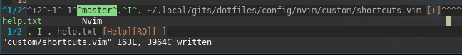
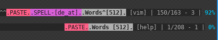

# nvim.files
Outsourced dotfiles repository for nvim + plug.vim. Fully automated setup.

This setup is fully automated. It has all needed directorys already setup and will install the rest during first execution.

To use my setup just download this repository and create a link to your nvim config folder

```
git clone https://github.com/mitschix/nvim.files
ln -s /path/to/repo/nvim.files ~/.config/nvim
```

Your will need to have neovim + python and clipboard support already setup.


Below is a list of my shortcuts for quicker review, to see if there is somethink interesting for you, since it took me a long time to comb through a lot of repositorys to find some gems. Hopefully this will speed up your journey. (:

There is a list of some repository I have saved, but there are far more out there.

## Used Plugins
List of used plugins

+  'mcchrish/nnn.vim'
+  'junegunn/goyo.vim'
+  'vimwiki/vimwiki'
+  'mbbill/undotree'
+  'junegunn/fzf', {'do': './install --all' }
+  'junegunn/fzf.vim'
+  'tpope/vim-fugitive'
+  'airblade/vim-gitgutter'
+  'ycm-core/YouCompleteMe', {'do': './install.py'}
+  'sirver/ultisnips' | Plug 'honza/vim-snippets'
+  'PotatoesMaster/i3-vim-syntax'
+  'tomtom/tcomment_vim'
+  'dhruvasagar/vim-table-mode'
+  'dbeniamine/cheat.sh-vim'
+  'flrnprz/plastic.vim'
+  'ThePrimeagen/vim-be-good'

## Custom statusline
Since there is a lot going on in my custom statusline and it is not a plugin, there is a short explanation of my status line:



On the left side of me status line it will show:
+ The current and maximum tab number, if there is another tab open
+ The modification if in a git repository (+ line added, ~ line modified, - line deleted) it will only show them if there are changes
+ The current branch if in a git repository
+ An inidcator for current mode with different colors
+ The absolut path and filename
+ A flag that shows if help page \[Help\]
+ A flag that indicates Read-Only files \[RO\]
+ A flag that indicates if modified \[+\]; \[-\] if modifiable is off




On the right side it will show:
+ A flag for paste mode if enabled
+ A flag for spelling including spellang if enabled 
+ The word count indicator with counted words - if word count is activated
+ The filetype
+ The current line / maximum lines
+ The current column
+ A % inidicator of the position in the file,


The  **^** symbols everywhere are there because of the split and indicates your current focused window. Have not found a way to get rid of those. ._.

## Custom keymappings
used \<leader\> is ","

| Mapping          | Command                                     | Mode     | Description                                                  |
|------------------|---------------------------------------------|----------|--------------------------------------------------------------|
| \<leader\>sv     | :so $MYVIMRC\<CR\>                          | nmap     | Source config file                                           |
| \<leader\>ev     | \<C-w\>\<C-v\>\<C-l\>:e $MYVIMRC\<CR\>      | nmap     | Edit config file in vertical split                           |
| \<leader\>\<CR\> | :w\<CR\>                                    | map      | Quick save                                                   |
| \<C-Tab\>        | :tabnext\<CR\>                              | map      | Switch to next Tab                                           |
| \<S-Tab\>        | :bNext\<CR\>                                | nmap     | Switch to next Buffer                                        |
| \<Tab\>          | :bnext\<CR\>                                | nmap     | Switch to next Buffer                                        |
| :w!!             | %!sudo tee > /dev/null %                    | cmap     | Write read only file                                         |
| \<leader\>p      | "+p                                         | noremap  | Paste from system clipboard                                  |
| \<leader\>y      | "+y                                         | vnoremap | Yank visual selection to system clipboard                    |
| \<leader\>y      | V"+y                                        | nnoremap | Yank whole line to system clipboard                          |
| \<leader\>Y      | "+y                                         | nnoremap | Enable Yank mode for next command (e.g w[ord])               |
| Y                | y$                                          | nnoremap | Yank till the rest of the line                               |
| p                | pgvy                                        | xnoremap | Do not overwrite Buffer with paste                           |
| \<C-f\>          | \<C-x\>\<C-f\>                              | imap     | More convienient way to complete files with ^X               |
| \<C-]\>          | \<C-x\>\<C-]\>                              | imap     | More convienient way to complete tags with ^X                |
| \<C-l\>          | \<C-x\>\<C-l\>                              | imap     | More convienient way to complete lines with ^X               |
| H                | ^                                           | nmap     | Jump to beginning of line                                    |
| L                | $                                           | nmap     | Jump to end of line                                          |
| j                | gj                                          | nnoremap | Move one visual line down (even when wrapped)                 |
| k                | gk                                          | nnoremap | Move one visual line up (even when wrapped)                   |
| gj               | j                                           | nnoremap | Use default behaviour of j                                   |
| gk               | k                                           | nnoremap | Use default behaviour of k                                   |
| jk               | \<Esc\>                                     | inoremap | Escape mode                                                  |
| jk               | \<Esc\>                                     | xnoremap | Escape mode                                                  |
| jk               | \<C-c\>                                     | cnoremap | Escape mode                                                  |
| \<f3\>           | :call ToggleNetrw()\<CR\>                   | map      | Toggle Netrw file explorer                                   |
| \<f6\>           | :setlocal spell! spelllang=de_at\<CR\>      | map      | Toggle spelling in german                                    |
| \<f7\>           | :setlocal spell! spelllang=en_us\<CR\>      | map      | Toggle spelling in english                                   |
| \<leader\>o      | o\<Esc\>                                    | nnoremap | Add line below curser                                        |
| \<leader\>O      | O\<Esc\>                                    | nnoremap | Add line above curser                                        |
| \<C-j\>          | \<C-W\>j                                    | map      | Remap window movement to not need \<C-W\> prepanded          |
| \<C-k\>          | \<C-W\>k                                    | map      | Remap window movement to not need \<C-W\> prepanded          |
| \<C-h\>          | \<C-W\>h                                    | map      | Remap window movement to not need \<C-W\> prepanded          |
| \<C-l\>          | \<C-W\>l                                    | map      | Remap window movement to not need \<C-W\> prepanded          |
| \<C-h\>          | \<C-o\>h                                    | inoremap | Enable movement in insert mode with h                        |
| \<C-l\>          | \<C-o\>a                                    | inoremap | Enable movement in insert mode with l                        |
| \<C-j\>          | \<C-o\>j                                    | inoremap | Enable movement in insert mode with j                        |
| \<C-k\>          | \<C-o\>k                                    | inoremap | Enable movement in insert mode with k                        |
| \<Up\>           | :resize +2\<CR\>                            | nnoremap | Remap arrow keys to not use them (or only to resize windows) |
| \<Down\>         | :resize -2\<CR\>                            | nnoremap | Remap arrow keys to not use them (or only to resize windows) |
| \<Left\>         | :vertical resize +2\<CR\>                   | nnoremap | Remap arrow keys to not use them (or only to resize windows) |
| \<Right>         | :vertical resize -2\<CR\>                   | nnoremap | Remap arrow keys to not use them (or only to resize windows) |
| \<leader\>D      | \<C-r>=strftime('%F')\<CR\>                 | inoremap | Insert current date YYYY-MM-DD format                        |
| \<leader\>D      | i\<C-r>=strftime('%F')\<CR\>\<Esc\>         | nnoremap | Insert current date YYYY-MM-DD format                        |
| \<leader\>wc     | :call WordCount()\<CR\>                     | nnoremap | Toggle word count on/off                                     |
| \<leader\>wu     | :call WordCount('update')\<CR\>             | nnoremap | Update word count                                            |
| "\<tab\>         | ""\<Left\>                                  | imap     | add second " and enters surrounding                          |
| '\<tab\>         | ''\<Left\>                                  | imap     | add second ' and enters surrounding                          |
| (\<tab\>         | ()\<Left\>                                  | imap     | add closing ) and enters surrounding                         |
| [\<tab\>         | []\<Left\>                                  | imap     | add closing ] and enters surrounding                         |
| {\<tab\>         | {}\<Left\>                                  | imap     | add closing } and enters surrounding                         |
| {\<CR\>          | {\<CR\>}\<Esc\>O                            | imap     | add closing } line breaks and enters surrounding above       |
| {;\<CR\>         | {\<CR\>};\<Esc\>O                           | imap     | add closing }; line breaks and enters surrounding above      |
| \<leader\>W      | :%s/\s\+$//\<CR\>:let @/=''\<CR\>           | nmap     | Strip trailing white spaces                                  |
| \<leader\>cp     | :set paste / :set nopaste                   | nnoremap | Toggle paste mode                                            |
| \<leader\>cl     | :set list / :set nolist                     | nnoremap | Toggle list option - show tabs and spaces (listchars)        |
| \<leader\>cn     | :set number! relativenumber!                | nnoremap | Toggle line all numbers                                      |
| \<leader\>cw     | :set wrap / :set nowrap                     | nnoremap | Toggle wrap                                                  |
| \<leader\>ch     | :set hlsearch / :set nohlsearch             | nnoremap | Toggle highlight of searched word                            |
| \<leader\>cm     | :set mouse= / :set mouse=a                  | nnoremap | Toggle mouse support                                         |
| \<leader\>ct     | :set textwidgt=\<nr\>                       | nnoremap | Change textwidth to given number                             |
| \<leader\>cb     | :set background=light / set background=dark | nnoremap | Toggle background to dark/light                              |


## Custom Key Mapping for Plugins

| Mapping      | Command                     | Mode     | Description                                                  |
|--------------|-----------------------------|----------|--------------------------------------------------------------|
| \<C-b\>      | Buffers\<CR\>               | nmap     | Use fzf Buffers command to switch buffer                     |
| \<C-f\>      | :Files\<CR\>                | nmap     | Use fzf Files command to switch file                         |
| \<leader\>cg | :Goyo                       | nnoremap | Toggle Goyo - Plugin to Focus editor and disable distraction |
| \<f2\>       | :NnnPicker '%:p:h'\<CR\>    | map      | Toggle NNN File explorer                                     |
| \<f4\>       | :call ToggleGStatus()\<CR\> | map      | Toggle git status                                            |
| \<leader\>gd | :YcmCompleter GoTo\<CR\>    | nnoremap | Use YCM go to definition command                             |
| \<Leader\>gf | :YcmCompleter FixIt\<CR\>   | nnoremap | Use YCM Fix it command                                       |
| )            | <Plug>(GitGutterNextHunk)   | nmap     | Jump to the next hunk of GitGutter                           |
| (            | <Plug>(GitGutterPrevHunk)   | nmap     | Jump to the previous hunk of GitGutter                       |


## Read Repos/dotfiles/posts to find my gems
+ [BrodieRobertson](https://github.com/BrodieRobertson/dotfiles/blob/master/config/nvim/init.vim)
+ [DamianConway](https://github.com/thoughtstream/Damian-Conway-s-Vim-Setup/blob/cbe1fb5b5505e17bd7709669168c367903d94cd4/.vimrc#L1)
+ [nickjj](https://github.com/nickjj/dotfiles/blob/master/.vimrc)
+ [junegunn](https://github.com/junegunn/dotfiles/blob/master/vimrc)
+ [christoomey](https://github.com/christoomey/dotfiles/tree/master/vim/rcfiles)
+ [godlygeek](https://github.com/godlygeek/vim-files/blob/master/.vimrc)
+ [vbrandl](https://github.com/vbrandl/dotfiles/blob/master/editors/vim/vimrc)
+ [ChristianChiarulli](https://github.com/ChristianChiarulli/nvim)
+ [stevelosh](https://stevelosh.com/blog/2010/09/coming-home-to-vim/)
+ [nicknisi](https://github.com/nicknisi/dotfiles/blob/master/config/nvim/init.vim)
+ [vim-bootstrap](https://vim-bootstrap.com/)
+ ... there have been far more, unfortunately I have not saved all of them. - sorry ):
